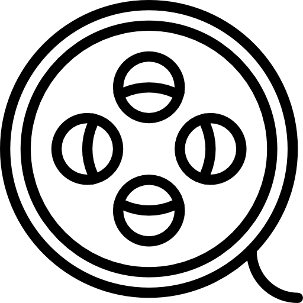
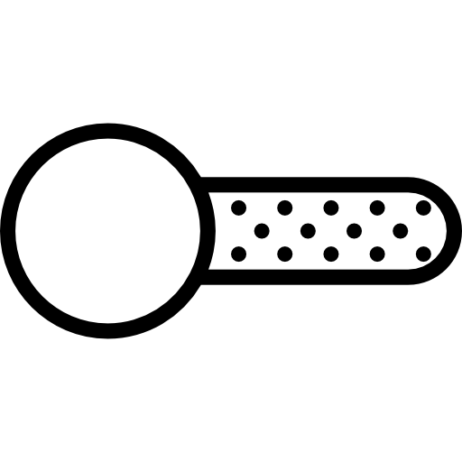
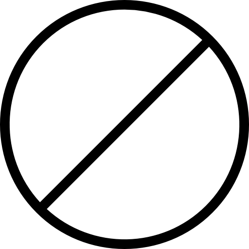

# Essential Icons for React Native

### react-native-ico-essential

380 Vector Icons for React Native

  

## List of icons

- [List of Essential Icons](http://ico.simpleness.org/pack/essential)

## Usage

```
import Icon from 'react-native-ico-essential';


// Inside some view component
render() {
    return (
        <>
          <Icon name="film" />
          <Icon name="switch" height="40" width="40" />
          <Icon name="forbidden" color="red" />
          <Icon name="forbidden" colors={{ "#000000": "#FFFFFF" }} />
          <Icon name="switch" badge="10" />
          <Icon name="switch" badge={{value: 'A', fontSize: 25, radius: 22, position:'top_left', color:'orange', backgroundColor:'blue'}}/>
          <Icon name="film" background="circle" />
          <Icon name="film" background={{ type: "button", color: 'green' }} />
        </>
    );
}

```

## Installation

#### yarn

```bash
yarn add react-native-ico-essential react-native-svg
```

#### npm

```bash
npm install --save react-native-ico-essential react-native-svg
```

### Link react-native-svg

```bash
react-native link react-native-svg
```

`react-native-svg` is a peer dependency. Install a current version in the app so the package uses the app-level native module instead of pulling in an older nested copy.

### pod install (for iOS)

```
cd ios && pod install && cd ..
```

## API

### <Icon name [color width height background badge ...rest] />

Returns a SvgXml icon by name and group.

 name | optional | default value | description | examples
------|----------|---------------|-------------|---------
name | no |  | name of icon | "film"
color | yes | | line color, css style | "#00ff00", "#0f0", "green"
colors | yes | | replace colors | {"#FFFFFF": "#000000", "#f00": "#00f"} // white to black, red to blue
width | yes | 20 | width of the icon | 40
height | yes | 20 | height of the icon | 40
background | yes | | background type | "circle"
background | yes | | background object | {type: "circle", color: 'yellow'}
badge | yes | | badge string | "10"
badge | yes | | badge object | {value: 'A', fontSize: 25, radius: 22, position:'top_left', color:'orange', backgroundColor:'blue'}
...rest | yes | | other props | style={{backgroundColor: "#00f"}}

## Icons Made by

[Dave Gandy](https://www.flaticon.com/authors/dave-gandy)

## Created by

Dimitry Ivanov <2@ivanoff.org.ua> # curl -A cv ivanoff.org.ua
